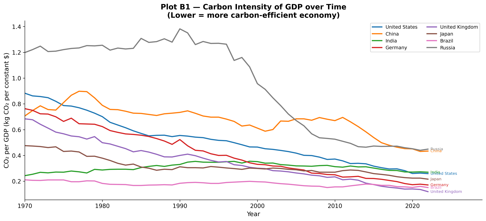
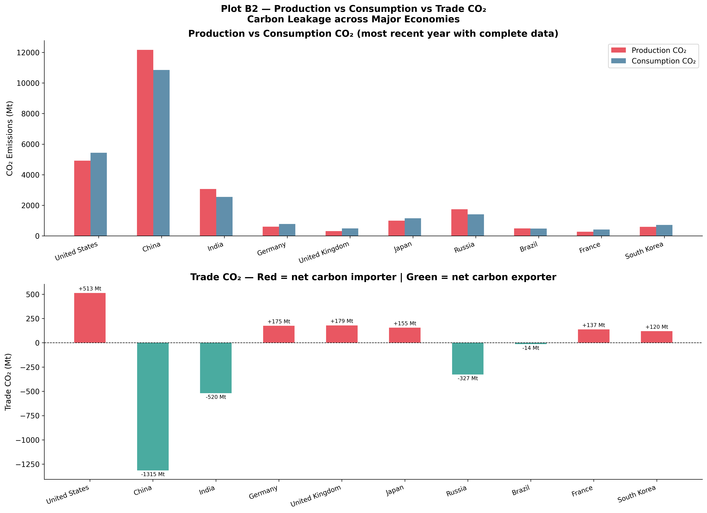
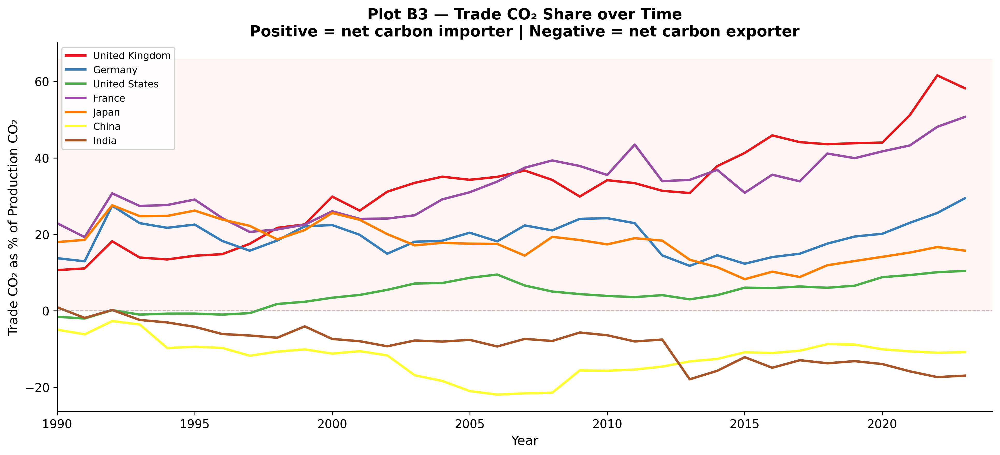

```{python}
#| echo: false
import warnings
warnings.filterwarnings("ignore")

import pandas as pd
import numpy as np
import matplotlib.pyplot as plt
import matplotlib.patches as mpatches
import matplotlib.ticker as mticker
import seaborn as sns
from pathlib import Path

%matplotlib inline
plt.rcParams.update({
    "font.family":       "DejaVu Sans",
    "font.size":         11,
    "axes.titlesize":    14,
    "axes.titleweight":  "bold",
    "axes.labelsize":    12,
    "axes.spines.top":   False,
    "axes.spines.right": False,
    "figure.dpi":        120,
    "savefig.dpi":       300,
    "savefig.bbox":      "tight",
    "savefig.facecolor": "white",
    "legend.framealpha": 0.85,
})

COUNTRY_COLORS = {
    "United States":       "#E63946",
    "China":               "#F4A261",
    "India":               "#2A9D8F",
    "Brazil":              "#457B9D",
    "Russia":              "#8338EC",
    "Germany":             "#06D6A0",
    "United Kingdom":      "#FFB703",
    "Japan":               "#FB8500",
    "European Union (27)": "#3A86FF",
    "Indonesia":           "#FF006E",
}

# Load data
CSV_PATH = "./owid-co2-data.csv"
df = pd.read_csv(CSV_PATH, low_memory=False)
if "gdp_per_capita" not in df.columns:
    df["gdp_per_capita"] = df["gdp"] / df["population"]

country_df = df[df["iso_code"].notna() & (df["iso_code"] != "")].copy()
world_df   = df[df["country"] == "World"].copy()

# Output directory
OUT = Path("./Plots/B")
OUT.mkdir(parents=True, exist_ok=True)
```

## Decoupling GDP from Carbon Intensity

Plot A demonstrated that economic growth generally drives absolute emissions. Plot B1 challenges this by examining **Carbon Intensity**—the amount of CO₂ emitted per unit of economic output (kg CO₂ per dollar of GDP). This metric evaluates whether an economy is structuring itself more efficiently over time.



```{python}
countries_b1 = ["United States","China","India","Germany","United Kingdom","Japan","Brazil","Russia"]
palette_b1   = sns.color_palette("tab10", len(countries_b1))

fig, ax = plt.subplots(figsize=(13, 6))
for country, colour in zip(countries_b1, palette_b1):
    sub = (country_df[(country_df["country"] == country) & (country_df["year"] >= 1970)]
           [["year","co2_per_gdp"]].dropna())
    if sub.empty: continue
    ax.plot(sub["year"], sub["co2_per_gdp"], label=country, color=colour, linewidth=2.2)
    last = sub.iloc[-1]
    ax.annotate(f"  {country}", (last["year"], last["co2_per_gdp"]),
                fontsize=7.5, color=colour, va="center")

ax.set_xlabel("Year")
ax.set_ylabel("CO₂ per GDP (kg CO₂ per constant $)")
ax.set_title("Plot B1 — Carbon Intensity of GDP over Time\n(Lower = more carbon-efficient economy)")
ax.legend(fontsize=9, ncol=2, loc="upper right")
ax.set_xlim(1970, country_df["year"].max() + 5)

plt.tight_layout()
plt.savefig(OUT / "B1_co2_per_gdp_over_time.png")
plt.close()
```

A long-term trend analysis (1970–2022) reveals a nearly universal decline in carbon intensity globally. This points to widespread efficiency gains driven by technological improvements, structural shifts toward service economies, and the gradual adoption of renewables. 

However, distinct trajectories exist:
- **Developed Economies (UK, Germany)** exhibit the steepest declines in carbon intensity. This suggests a successful "relative decoupling," where robust economic expansion occurs alongside shrinking carbon footprints per dollar earned.
- **China and India**, while historically maintaining higher carbon intensities due to their heavy reliance on coal and manufacturing, are currently on steep downward trajectories. This reflects massive recent investments in renewables and modern industrial efficiency.
- **Russia** remains a stark outlier. Inheriting energy-intensive Soviet infrastructure and maintaining heavy reliance on fossil fuel extraction, its economy remains one of the least carbon-efficient in the dataset.

*Crucially, declining carbon intensity does not necessarily mean absolute emissions are falling—if an economy grows faster than its efficiency improves, total emissions still rise.*

## The Illusion of Domestic Decarbonization: Trade & Carbon Leakage

If countries like the UK and Germany are aggressively reducing their domestic carbon intensity, are they truly solving the emissions problem, or simply exporting it?

Traditional climate accounting relies on **production-based emissions** (emissions physically generated within a country's borders). However, this framework ignores **consumption-based emissions** (the total global emissions generated to produce the goods a country consumes). 

Plot B2 compares these two metrics across major economies.



```{python}
economies_b2 = ["United States","China","India","Germany","United Kingdom","Japan","Russia","Brazil","France","South Korea"]
rows_b2 = []
for e in economies_b2:
    sub = country_df[country_df["country"] == e].sort_values("year", ascending=False)
    for _, row in sub.iterrows():
        if pd.notna(row["co2"]) and pd.notna(row["consumption_co2"]) and pd.notna(row["trade_co2"]):
            rows_b2.append({"country": e, "Production CO₂": row["co2"],
                            "Consumption CO₂": row["consumption_co2"],
                            "Trade CO₂": row["trade_co2"], "year": row["year"]})
            break

df_b2 = pd.DataFrame(rows_b2)
x     = np.arange(len(df_b2))
w     = 0.26

fig, (ax_top, ax_bot) = plt.subplots(2, 1, figsize=(15, 11))
fig.suptitle("Plot B2 — Production vs Consumption vs Trade CO₂\nCarbon Leakage across Major Economies", fontsize=14, fontweight="bold")

# Top: grouped bars
ax_top.bar(x - w, df_b2["Production CO₂"],  w, label="Production CO₂",  color="#E63946", alpha=0.85)
ax_top.bar(x,     df_b2["Consumption CO₂"], w, label="Consumption CO₂", color="#457B9D", alpha=0.85)
ax_top.set_xticks(x)
ax_top.set_xticklabels(df_b2["country"], rotation=20, ha="right", fontsize=10)
ax_top.set_ylabel("CO₂ Emissions (Mt)")
ax_top.set_title("Production vs Consumption CO₂ (most recent year with complete data)")
ax_top.legend()
ax_top.spines["top"].set_visible(False); ax_top.spines["right"].set_visible(False)

# Bottom: Trade CO₂
trade_colours = ["#E63946" if v >= 0 else "#2A9D8F" for v in df_b2["Trade CO₂"]]
ax_bot.bar(x, df_b2["Trade CO₂"], color=trade_colours, alpha=0.85, width=0.5)
ax_bot.axhline(0, color="black", linewidth=0.8, linestyle="--")
ax_bot.set_xticks(x)
ax_bot.set_xticklabels(df_b2["country"], rotation=20, ha="right", fontsize=10)
ax_bot.set_ylabel("Trade CO₂ (Mt)")
ax_bot.set_title("Trade CO₂ — Red = net carbon importer | Green = net carbon exporter")
ax_bot.spines["top"].set_visible(False); ax_bot.spines["right"].set_visible(False)

# Annotations
for i, (val, pct) in enumerate(zip(df_b2["Trade CO₂"], df_b2.get("trade_co2_share", [None]*len(df_b2)))):
    ax_bot.text(i, val + (15 if val >= 0 else -15), f"{val:+.0f} Mt",
                ha="center", va="bottom" if val >= 0 else "top", fontsize=8)

plt.tight_layout()
plt.savefig(OUT / "B2_production_vs_consumption_trade_co2.png")
plt.close()
```

This comparison exposes the phenomenon of **carbon leakage**:
- **Carbon Importers (The West)**: The United States, United Kingdom, and the EU block display significantly higher consumption emissions than production emissions. Their "clean" domestic profiles are partially an illusion created by importing manufactured goods.
- **Carbon Exporters (The East)**: China displays massive production emissions, but heavily diminished consumption emissions. China effectively acts as the global manufacturing hub, producing goods (and their associated emissions) for Western markets. Russia similarly exports vast amounts of embodied carbon through fossil fuels.

## The Evolution of Embodied Carbon Trade

Plot B3 tracks this reliance on imported carbon over time, showing the proportion of total emissions linked to international trade. 



```{python}
countries_b3 = ["United Kingdom","Germany","United States","France","Japan","China","India"]
palette_b3   = sns.color_palette("Set1", len(countries_b3))

fig, ax = plt.subplots(figsize=(13, 6))
for country, colour in zip(countries_b3, palette_b3):
    sub = (country_df[(country_df["country"] == country) & (country_df["year"] >= 1990)]
           [["year","trade_co2_share"]].dropna())
    if sub.empty: continue
    ax.plot(sub["year"], sub["trade_co2_share"], label=country, color=colour, linewidth=2.2)

ax.axhline(0, color="grey", linewidth=0.8, linestyle="--", alpha=0.7)
ax.fill_between(ax.get_xlim(), 0, ax.get_ylim()[1] if ax.get_ylim()[1] > 0 else 100,
                alpha=0.04, color="red", label="_nolegend_")
ax.set_xlabel("Year")
ax.set_ylabel("Trade CO₂ as % of Production CO₂")
ax.set_title("Plot B3 — Trade CO₂ Share over Time\nPositive = net carbon importer | Negative = net carbon exporter")
ax.legend(fontsize=9)
ax.set_xlim(1990, country_df["year"].max())

plt.tight_layout()
plt.savefig(OUT / "B3_trade_co2_share_over_time.png")
plt.close()
```

- **The UK and France** maintain some of the largest positive trade CO₂ shares. Their economies' structural shifts to the service sector have made them highly reliant on offshore manufacturing. 
- **The US** acts as a moderate carbon importer, a trend that accelerated during the globalization booms of the late 20th century.
- **China consistently acts as the world's primary carbon exporter**, carrying the production burden for foreign demand. As **India's** manufacturing sector expands, a similar trend of exported carbon is emerging.

### Synthesis

Together, these metrics paint a complex picture of global responsibility. While developed nations are genuinely improving their domestic carbon efficiency, a significant portion of their apparent decarbonization success stems from offshoring heavy industry to developing nations. True climate accounting requires analyzing the global supply chain, not just the domestic smokestack.
