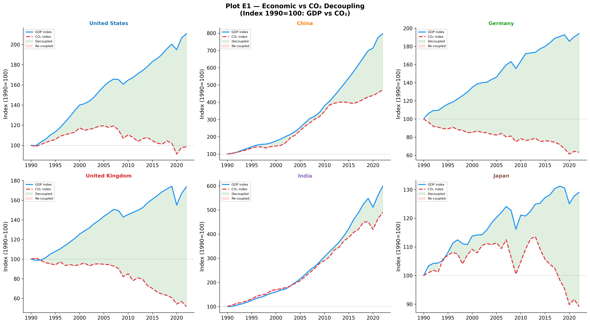
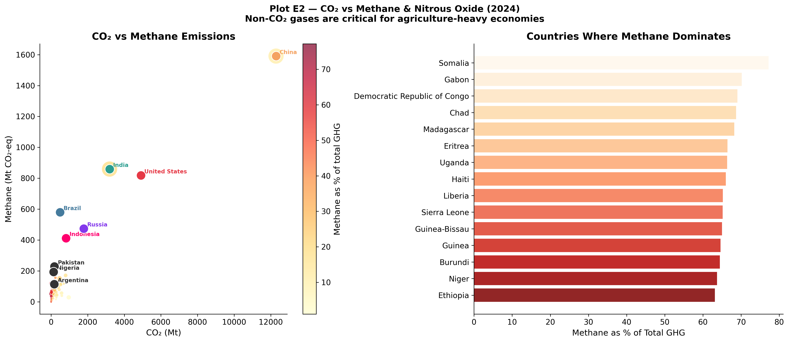

```{python}
#| echo: false
import warnings
warnings.filterwarnings("ignore")

import pandas as pd
import numpy as np
import matplotlib.pyplot as plt
import matplotlib.patches as mpatches
import matplotlib.ticker as mticker
import seaborn as sns
from pathlib import Path

%matplotlib inline
plt.rcParams.update({
    "font.family":       "DejaVu Sans",
    "font.size":         11,
    "axes.titlesize":    14,
    "axes.titleweight":  "bold",
    "axes.labelsize":    12,
    "axes.spines.top":   False,
    "axes.spines.right": False,
    "figure.dpi":        120,
    "savefig.dpi":       300,
    "savefig.bbox":      "tight",
    "savefig.facecolor": "white",
    "legend.framealpha": 0.85,
})

COUNTRY_COLORS = {
    "United States":       "#E63946",
    "China":               "#F4A261",
    "India":               "#2A9D8F",
    "Brazil":              "#457B9D",
    "Russia":              "#8338EC",
    "Germany":             "#06D6A0",
    "United Kingdom":      "#FFB703",
    "Japan":               "#FB8500",
    "European Union (27)": "#3A86FF",
    "Indonesia":           "#FF006E",
}

# Load data
CSV_PATH = "./owid-co2-data.csv"
df = pd.read_csv(CSV_PATH, low_memory=False)
if "gdp_per_capita" not in df.columns:
    df["gdp_per_capita"] = df["gdp"] / df["population"]

country_df = df[df["iso_code"].notna() & (df["iso_code"] != "")].copy()
world_df   = df[df["country"] == "World"].copy()

# Output directory
OUT = Path("./Plots/E")
OUT.mkdir(parents=True, exist_ok=True)
```

## Identifying True Decoupling

A central question of climate economics is whether continuous economic growth is compatible with deep decarbonization. Plot E1 tests this by comparing indexed GDP growth alongside indexed CO₂ emissions (using 1990 as a baseline) for major economies.



```{python}
countries_e1 = ["United States","China","Germany","United Kingdom","India","Japan"]
palette_e1   = sns.color_palette("tab10", len(countries_e1))
BASE_YEAR    = 1990

fig, axes = plt.subplots(2, 3, figsize=(18, 10))
fig.suptitle("Plot E1 — Economic vs CO₂ Decoupling\n(Index 1990=100: GDP vs CO₂)", fontsize=14, fontweight="bold")

for ax, country, colour in zip(axes.flat, countries_e1, palette_e1):
    sub = country_df[(country_df["country"] == country) & (country_df["year"] >= BASE_YEAR)].dropna(subset=["gdp","co2"])
    if sub.empty or BASE_YEAR not in sub["year"].values:
        ax.set_title(f"{country}\n(insufficient data)"); continue
    base_gdp = sub[sub["year"]==BASE_YEAR]["gdp"].values[0]
    base_co2 = sub[sub["year"]==BASE_YEAR]["co2"].values[0]
    idx_gdp  = sub["gdp"] / base_gdp * 100
    idx_co2  = sub["co2"] / base_co2 * 100

    ax.plot(sub["year"], idx_gdp, color="#2196F3", linewidth=2.2, label="GDP index")
    ax.plot(sub["year"], idx_co2, color="#E63946", linewidth=2.2, label="CO₂ index", linestyle="--")
    ax.fill_between(sub["year"], idx_gdp, idx_co2,
                    where=(idx_gdp > idx_co2), alpha=0.12, color="green", label="Decoupled")
    ax.fill_between(sub["year"], idx_gdp, idx_co2,
                    where=(idx_gdp <= idx_co2), alpha=0.12, color="red", label="Re-coupled")
    ax.axhline(100, color="grey", linewidth=0.7, linestyle=":")
    ax.set_title(f"{country}", fontsize=11, fontweight="bold", color=colour)
    ax.set_ylabel("Index (1990=100)"); ax.legend(fontsize=7)
    ax.spines["top"].set_visible(False); ax.spines["right"].set_visible(False)

plt.tight_layout()
plt.savefig(OUT / "E1_decoupling_gdp_vs_co2.png")
plt.close()
```

This temporal tracking reveals distinct archetypes of economic development:
- **Absolute Decoupling**: The United Kingdom and Germany provide robust empirical evidence that absolute decoupling is possible. Since 1990, the UK economy has expanded by roughly 75% while domestic emissions have been slashed by nearly 50%. Driven by aggressive coal phase-outs, offshore wind expansion, and targeted policies, these nations are breaking the historical link between wealth and carbon.
- **Relative Decoupling**: The United States demonstrates relative decoupling. Its economy has more than doubled since 1990, while emissions have remained stable, only beginning a gradual decline post-2008 due to the shale gas revolution substituting coal.
- **Recoupling / Coupling**: Rapidly industrializing economies like China and India show tight coupling. China's GDP grew nearly eightfold since 1990, dragging emissions up to 450% of their baseline. This illustrates the massive carbon requirement currently built into rapid, infrastructure-heavy development.

## The Scope of Comprehensive Accounting

Carbon dioxide dominates the public conversation, but true climate impact modeling requires comprehensive accounting of all greenhouse gases, particularly **methane (CH₄)** and **nitrous oxide (N₂O)**.

Plot E2 compares CO₂ emissions against methane and N₂O, exposing the distinct profiles of agricultural versus energy-centric economies.



```{python}
df_e2 = country_df[country_df["year"] == 2024][["country","co2","methane","nitrous_oxide","population"]].dropna()
df_e2["non_co2"] = df_e2["methane"] + df_e2["nitrous_oxide"]
df_e2["methane_share"] = df_e2["methane"] / (df_e2["co2"] + df_e2["non_co2"]) * 100

fig, axes = plt.subplots(1, 2, figsize=(16, 7))
fig.suptitle("Plot E2 — CO₂ vs Methane & Nitrous Oxide (2024)\nNon-CO₂ gases are critical for agriculture-heavy economies", fontsize=13, fontweight="bold")

# Left: CO2 vs Methane
sizes_e2 = np.clip(df_e2["population"] / 1e6 * 0.35, 8, 500)
sc = axes[0].scatter(df_e2["co2"], df_e2["methane"],
                     c=df_e2["methane_share"], cmap="YlOrRd",
                     s=sizes_e2, alpha=0.7, edgecolors="white", linewidths=0.4)
plt.colorbar(sc, ax=axes[0], label="Methane as % of total GHG")
for country in ["Brazil","India","China","United States","Russia","Pakistan","Indonesia","Nigeria","Argentina"]:
    row = df_e2[df_e2["country"]==country]
    if row.empty: continue
    col = COUNTRY_COLORS.get(country,"#333")
    axes[0].scatter(row["co2"], row["methane"], s=180, color=col, edgecolors="white", zorder=6)
    axes[0].annotate(country, (row["co2"].values[0], row["methane"].values[0]),
                     xytext=(5,3), textcoords="offset points", fontsize=8, color=col, fontweight="bold")
axes[0].set_xlabel("CO₂ (Mt)"); axes[0].set_ylabel("Methane (Mt CO₂-eq)")
axes[0].set_title("CO₂ vs Methane Emissions")
axes[0].spines["top"].set_visible(False); axes[0].spines["right"].set_visible(False)

# Right: top methane % share
top_meth = df_e2.nlargest(15,"methane_share")
axes[1].barh(top_meth["country"][::-1], top_meth["methane_share"][::-1],
             color=plt.cm.get_cmap("OrRd", 15)([i/15 for i in range(15)])[::-1], alpha=0.85)
axes[1].set_xlabel("Methane as % of Total GHG")
axes[1].set_title("Countries Where Methane Dominates")
axes[1].spines["top"].set_visible(False); axes[1].spines["right"].set_visible(False)

plt.tight_layout()
plt.savefig(OUT / "E2_methane_nitrous_oxide_vs_co2.png")
plt.close()
```

When non-CO₂ gases are accounted for, the global emissions hierarchy shifts:
- **Energy Behemoths**: China and the United States lead in massive absolute CH₄ output, largely driven by fugitive emissions from coal mining and natural gas extraction. However, methane represents a comparatively small slice of their total GHG pie.
- **Agricultural Giants**: Brazil and India show highly elevated methane footprints relative to their CO₂ output. In these nations, livestock, rice cultivation, and land-use change generate significant non-CO₂ emissions independent of the fossil fuel system.
- **Methane-Dominated Economies**: Across numerous developing nations in Sub-Saharan Africa (such as Somalia, Chad, and Ethiopia), methane actually accounts for **over 70%** of their total greenhouse gas impact. 

### Synthesis
Evaluating decarbonization requires looking beyond the smokestack to the entire economic fabric. Absolute decoupling in Western economies proves that decarbonization is structurally possible, though carbon leakage (Plot B2) tempers that success. Furthermore, recognizing the massive role of methane in agricultural economies dictates that future climate finance and policy must expand beyond just fossil fuels to address livestock, land management, and agricultural practices.
