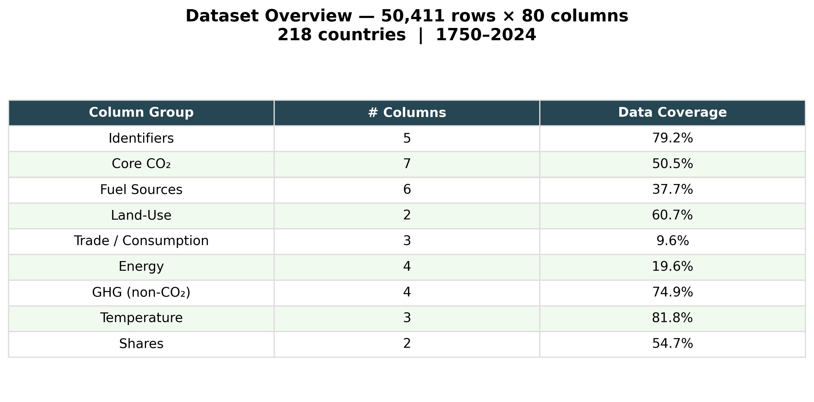
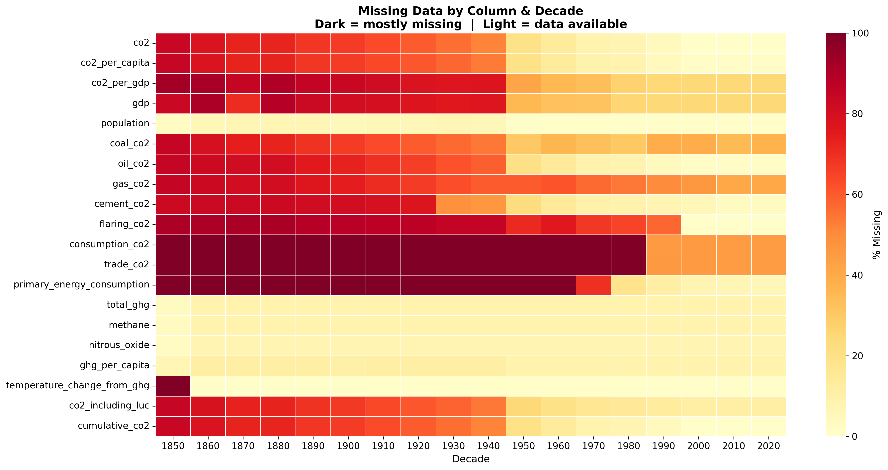
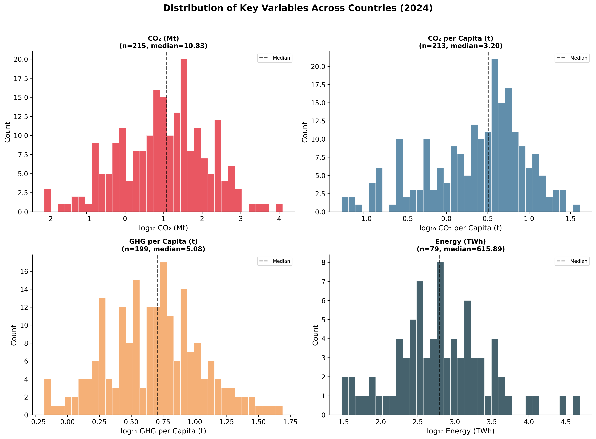
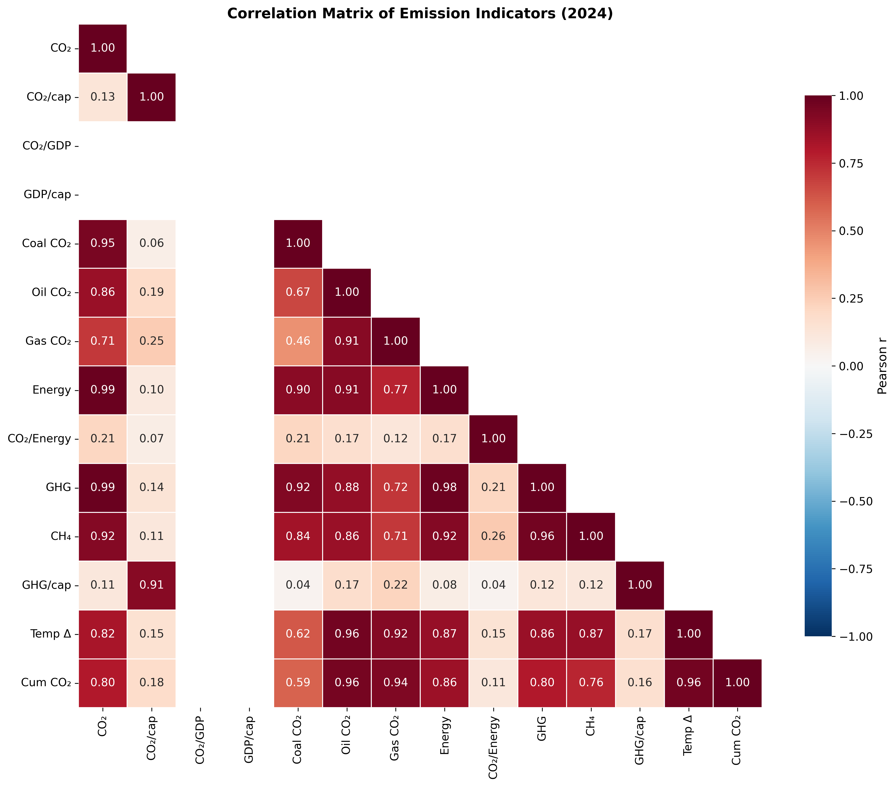
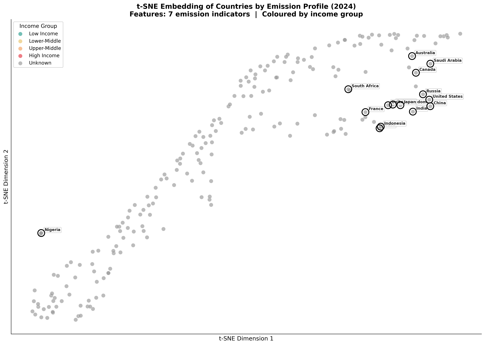
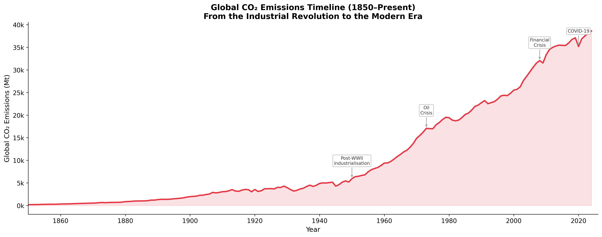
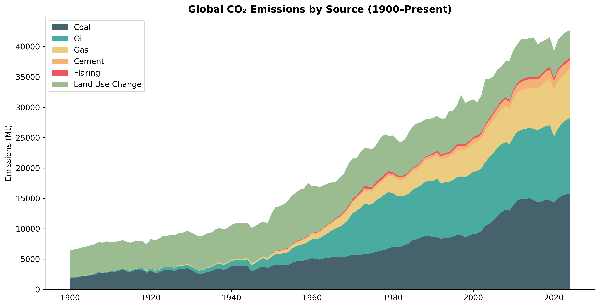
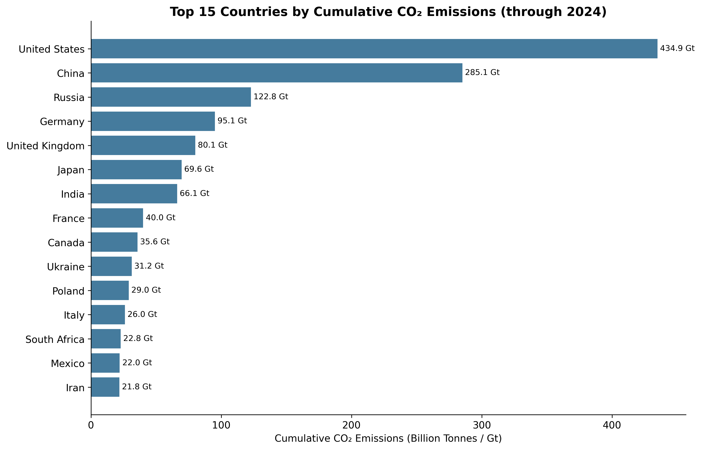

# Data Summary — CO₂ & Greenhouse Gas Emissions Dataset

**Source:** Our World in Data (OWID) — Global CO₂ and Greenhouse Gas Emissions  
**File:** `owid-co2-data.csv`  
**Period:** 1750–2024 (275 years of observations)  

---

## 1. Dataset Dimensions & Structure

The dataset contains **50,411 observations** across **80 columns**, covering **218 countries and territories** from 1750 to 2024. Each row represents a single country-year observation.

The 80 columns are organised into nine thematic groups:

| Group | Representative Columns | Purpose |
|---|---|---|
| **Identifiers** | `country`, `year`, `iso_code`, `population`, `gdp` | Row identification and socio-economic context |
| **Core CO₂** | `co2`, `co2_per_capita`, `co2_per_gdp`, `cumulative_co2` | Total and normalised fossil-fuel CO₂ emissions |
| **Fuel Sources** | `coal_co2`, `oil_co2`, `gas_co2`, `cement_co2`, `flaring_co2` | Emissions disaggregated by combustion source |
| **Land-Use** | `land_use_change_co2`, `co2_including_luc` | Deforestation and land-conversion emissions |
| **Trade / Consumption** | `consumption_co2`, `trade_co2`, `trade_co2_share` | Consumption-based accounting and embedded trade emissions |
| **Energy** | `primary_energy_consumption`, `co2_per_unit_energy` | Energy system scale and carbon intensity |
| **GHG (non-CO₂)** | `total_ghg`, `methane`, `nitrous_oxide`, `ghg_per_capita` | Full greenhouse gas accounting including CH₄ and N₂O |
| **Temperature** | `temperature_change_from_co2`, `share_of_temperature_change_from_ghg` | Attribution of observed warming to individual countries |
| **Shares** | `share_global_co2`, `share_global_cumulative_co2` | Each country's fraction of global totals |

---

## 2. Data Coverage & Missingness

Data availability varies substantially across columns and time periods. Core emissions data (`co2`, `population`) is available from the mid-1800s onward, while trade, GHG, and temperature attribution data only becomes available from the 1990s.

**Key observations on data availability:**
- **co2** and **population** have near-complete coverage from 1850 onwards.  
- **Fuel-source breakdown** (coal, oil, gas) becomes available from approximately 1900.  
- **Trade and consumption-based CO₂** data is only available from ~1990, and only for countries with detailed economic reporting.  
- **GHG, methane, and nitrous oxide** data begins around 1990, sourced from the Jones et al. national contributions dataset.  
- **Temperature attribution** metrics are the most sparse — available only for selected years and countries with sufficient historical emission records.

This missingness pattern is not random; it reflects the historical development of measurement infrastructure. Pre-1950 data relies heavily on historical reconstructions, while post-1990 data benefits from satellite observations and standardised national reporting under the UNFCCC.

---

## 3. Distribution of Key Variables

The distributions of core variables across all countries in the most recent year reveal heavy right-skewness — a small number of countries dominate global emissions while the majority contribute very little.

**Key distributional findings:**

- **CO₂ emissions (Mt):** Extremely right-skewed. China (~12,000 Mt) and the United States (~4,800 Mt) are extreme outliers; the median country emits under 20 Mt. A log-scale transformation is necessary for meaningful cross-country comparison.

- **CO₂ per capita (tonnes/person):** Less skewed than absolute emissions (due to normalisation), but still ranges from under 0.1 t in Sub-Saharan Africa to over 30 t in Gulf states. The global median is approximately 3–4 tonnes per person.

- **GHG per capita:** Includes methane and nitrous oxide in addition to CO₂, enlarging the footprint of agriculture-heavy economies (e.g., Brazil, Argentina, Australia) relative to their CO₂-only figures.

- **Primary energy consumption (TWh):** Again dominated by China and the US, with the vast majority of countries consuming under 500 TWh.

---

## 4. Correlation Structure

The correlation heatmap reveals the relationships among 14 emission and economic indicators.

**Major correlations observed:**

- **CO₂ and energy consumption** are very strongly correlated (r ≈ 0.99) — confirming that fossil-fuel combustion for energy is the primary source of CO₂ emissions globally.

- **Total GHG and CO₂** correlate strongly (r > 0.95), but not perfectly. The gap is filled by methane and nitrous oxide, which are partially independent of the fossil fuel system (originating in agriculture and land use).

- **CO₂ per capita and GDP per capita** show moderate positive correlation (r ≈ 0.50–0.65), consistent with the Environmental Kuznets Curve observation from Plot A1: wealthier countries emit more per person, but with significant scatter due to policy and energy-mix differences.

- **CO₂ per GDP** (carbon intensity) is weakly or negatively correlated with GDP per capita, indicating that richer countries tend to produce economic output more efficiently in carbon terms.

- **Cumulative CO₂ and temperature attribution** are near-perfectly correlated — confirming that countries that have emitted the most historically are responsible for the most warming.

---

## 5. Country Clustering by Emission Profile (t-SNE)

To visualise how countries group by multi-dimensional emission characteristics, a t-SNE embedding was computed using 7 features: CO₂ per capita, CO₂ per GDP, coal/oil/gas emissions, cumulative CO₂, and share of global CO₂. Countries are coloured by income group (GDP per capita quartiles).

**Cluster interpretation:**

- **High-income, high-emission cluster** (upper-right region): The United States, Canada, Australia, and Gulf states cluster together — these are wealthy nations with high per-capita emissions driven by fossil-fuel dependence and car-centric urban design.

- **Industrial giants, isolated:** China and India appear as outliers, distant from both the high-income cluster and the low-income group. Their emission profiles are dominated by sheer scale (coal-driven industry) rather than per-capita intensity, giving them a unique position in the embedding.

- **European decouplers:** Germany, United Kingdom, France, and Japan form a distinct sub-cluster — high income but moderate-to-low per-capita emissions, reflecting successful energy transition and deindustrialisation.

- **Low-income, low-emission cluster** (left region): Sub-Saharan African and South Asian countries cluster tightly together — uniformly low emissions across all metrics. These countries contribute minimally to global emissions and warming.

- **Resource exporters:** Russia and Saudi Arabia sit between clusters — their emission profiles are shaped by fossil-fuel extraction rather than typical industrial or consumption patterns.

The t-SNE visualisation confirms that emission profiles are not simply a function of income. Countries with similar GDP per capita can occupy very different positions in the embedding depending on their energy mix, industrial structure, and policy trajectory.

---

## 6. Global Emissions Timeline

The long-run trajectory of global CO₂ emissions provides essential context for all subsequent analysis.

- **Pre-1950:** Emissions grew slowly, driven by coal-powered industrialisation in Europe and North America. By 1950, global emissions were approximately 6,000 Mt.

- **1950–1973 (The Great Acceleration):** Post-WWII industrial expansion, suburbanisation, and the rise of the automobile drove exponential growth. Emissions roughly tripled in this period.

- **1973–2000:** Growth slowed after the oil crises, but never reversed. Emissions continued climbing as developing nations industrialised.

- **2000–2019:** The most rapid absolute growth in history, driven primarily by China's industrial surge. Global emissions rose from ~25,000 Mt to ~37,000 Mt.

- **2020 (COVID-19):** A sharp but temporary ~5% decline due to pandemic lockdowns. Emissions rebounded fully by 2021–2022.

- **2022–2024:** Emissions have plateaued near historical highs (~38,000–39,000 Mt), with modest annual growth as renewable energy expansion begins to offset some fossil-fuel growth.

---

## 7. Global Emissions Composition

To understand the drivers of global CO₂, we can look at the composition of sources out of total global emissions over time. 

Historically, **Land Use Change** and **Coal** were the primary drivers. Over the 20th century, **Oil** and **Gas** increased structurally as transportation and broader energy-needs exploded.

---

## 8. Top Historical Contributors

Looking at the entire timeline since 1750, a few nations are responsible for a disproportionate amount of historical emissions relative to the global sum.

The **United States** and **China** are vastly ahead of the rest of the world, having each contributed hundreds of billions of tonnes to atmospheric CO₂ cumulatively over history.

---

## 9. Summary Statistics

| Metric | Value |
|---|---|
| Total rows | 50,411 |
| Total columns | 80 |
| Countries/territories | 218 |
| Year range | 1750–2024 |
| Global CO₂ (latest year) | ~38,000 Mt |
| Median country CO₂ per capita | ~3.5 tonnes |
| Top emitter (absolute) | China (~12,000 Mt) |
| Top emitter (per capita) | Qatar / Gulf states (~30+ t) |
| Lowest emitters (per capita) | Sub-Saharan Africa (<0.5 t) |

---

*Plots generated by `data_summary_plots.py` and `data_summary_plots_extra.py`. Data source: Our World in Data (OWID) CO₂ and Greenhouse Gas Emissions dataset, Global Carbon Budget (2025).*
