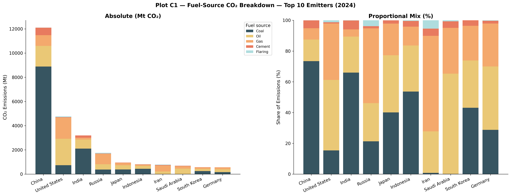
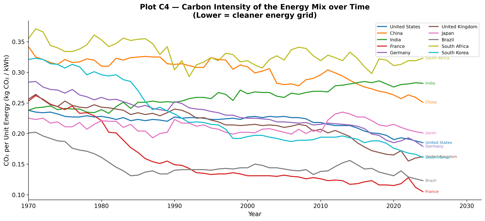
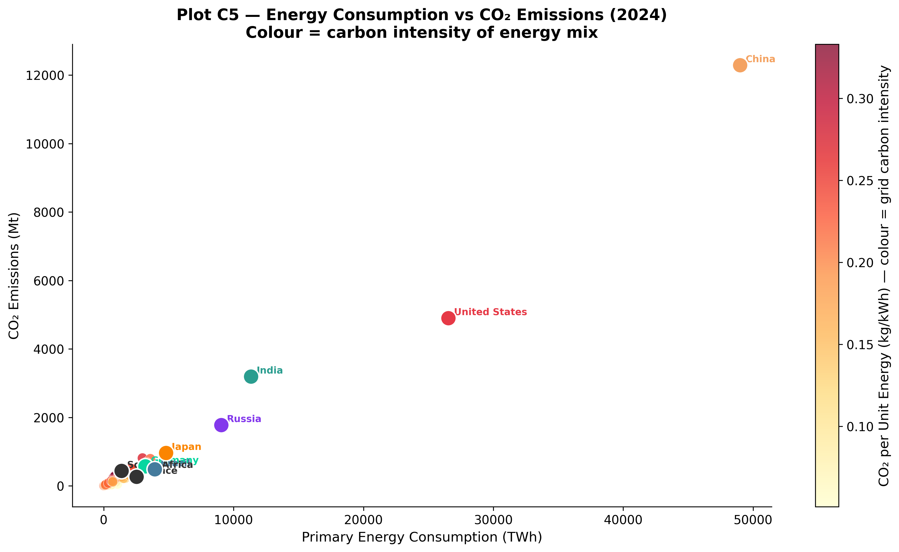
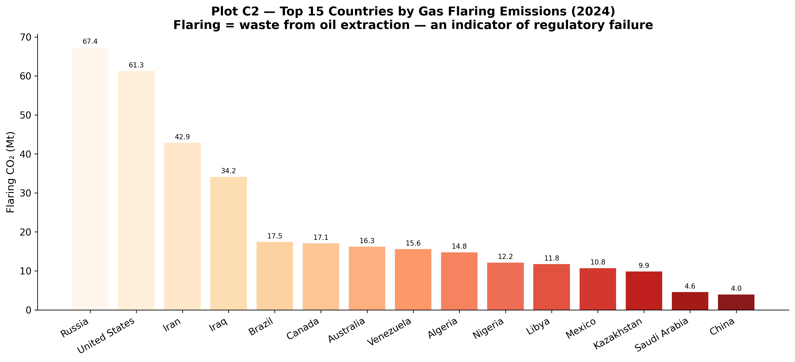

```{python}
#| echo: false
import warnings
warnings.filterwarnings("ignore")

import pandas as pd
import numpy as np
import matplotlib.pyplot as plt
import matplotlib.patches as mpatches
import matplotlib.ticker as mticker
import seaborn as sns
from pathlib import Path

%matplotlib inline
plt.rcParams.update({
    "font.family":       "DejaVu Sans",
    "font.size":         11,
    "axes.titlesize":    14,
    "axes.titleweight":  "bold",
    "axes.labelsize":    12,
    "axes.spines.top":   False,
    "axes.spines.right": False,
    "figure.dpi":        120,
    "savefig.dpi":       300,
    "savefig.bbox":      "tight",
    "savefig.facecolor": "white",
    "legend.framealpha": 0.85,
})

COUNTRY_COLORS = {
    "United States":       "#E63946",
    "China":               "#F4A261",
    "India":               "#2A9D8F",
    "Brazil":              "#457B9D",
    "Russia":              "#8338EC",
    "Germany":             "#06D6A0",
    "United Kingdom":      "#FFB703",
    "Japan":               "#FB8500",
    "European Union (27)": "#3A86FF",
    "Indonesia":           "#FF006E",
}

# Load data
CSV_PATH = "./owid-co2-data.csv"
df = pd.read_csv(CSV_PATH, low_memory=False)
if "gdp_per_capita" not in df.columns:
    df["gdp_per_capita"] = df["gdp"] / df["population"]

country_df = df[df["iso_code"].notna() & (df["iso_code"] != "")].copy()
world_df   = df[df["country"] == "World"].copy()

# Output directory
OUT = Path("./Plots/C")
OUT.mkdir(parents=True, exist_ok=True)
```

## Deconstructing the Fuel Mix

While total emissions reveal *how much* a country pollutes, breaking down those emissions by fuel source shows *why* they pollute. The structural dependence on specific energy sources fundamentally shapes a nation's decarbonization pathway.

Plot C1 breaks down the absolute emissions and proportional fuel mixes of the world's top ten emitters.



```{python}
fuels_c1   = ["coal_co2","oil_co2","gas_co2","cement_co2","flaring_co2"]
colours_c1 = ["#264653","#E9C46A","#F4A261","#E76F51","#A8DADC"]
labels_c1  = ["Coal","Oil","Gas","Cement","Flaring"]

df_c1_all = country_df.dropna(subset=fuels_c1)
latest_c1 = df_c1_all["year"].max()
df_c1     = df_c1_all[df_c1_all["year"] == latest_c1][["country"] + fuels_c1].copy()
df_c1["total"] = df_c1[fuels_c1].sum(axis=1)
top10_c1   = df_c1.nlargest(10, "total").reset_index(drop=True)

fig, (ax_main, ax_pct) = plt.subplots(1, 2, figsize=(18, 7))
fig.suptitle(f"Plot C1 — Fuel-Source CO₂ Breakdown — Top 10 Emitters ({latest_c1})", fontsize=14, fontweight="bold")

# Absolute stacked bar
bottom = np.zeros(len(top10_c1))
for fuel, colour, label in zip(fuels_c1, colours_c1, labels_c1):
    vals = top10_c1[fuel].fillna(0).values
    ax_main.bar(top10_c1["country"], vals, bottom=bottom, color=colour, label=label, alpha=0.92)
    bottom += vals
ax_main.set_xticklabels(top10_c1["country"], rotation=25, ha="right")
ax_main.set_ylabel("CO₂ Emissions (Mt)")
ax_main.set_title("Absolute (Mt CO₂)")
ax_main.legend(title="Fuel source", bbox_to_anchor=(1.01, 1), loc="upper left", fontsize=9)
ax_main.spines["top"].set_visible(False); ax_main.spines["right"].set_visible(False)

# 100% stacked bar
df_pct = top10_c1[fuels_c1].div(top10_c1["total"], axis=0) * 100
bottom_pct = np.zeros(len(df_pct))
for fuel, colour, label in zip(fuels_c1, colours_c1, labels_c1):
    vals = df_pct[fuel].fillna(0).values
    ax_pct.bar(top10_c1["country"], vals, bottom=bottom_pct, color=colour, label=label, alpha=0.92)
    bottom_pct += vals
ax_pct.set_xticklabels(top10_c1["country"], rotation=25, ha="right")
ax_pct.set_ylabel("Share of Emissions (%)")
ax_pct.set_title("Proportional Mix (%)")
ax_pct.set_ylim(0, 100)
ax_pct.spines["top"].set_visible(False); ax_pct.spines["right"].set_visible(False)

plt.tight_layout()
plt.savefig(OUT / "C1_fuel_breakdown_stacked.png")
plt.close()
```

### The Dominance of Coal in Asia
China's massive emissions (exceeding 12,000 Mt CO₂) are overwhelmingly driven by coal combustion, representing roughly three-quarters of its total emissions. This reflects a deep structural reliance on coal for both electricity generation and heavy industry (steel, cement). India exhibits a nearly identical proportional reliance on coal, though at a smaller absolute scale. For both nations, transitioning away from coal poses the single most significant decarbonization challenge.

### Diversified Energy and Oil Reliance
The United States demonstrates a more diversified footprint, with natural gas edging out coal and oil as the primary emission source, largely due to the post-2008 shale gas boom. Meanwhile, Middle Eastern producers like Iran and Saudi Arabia show almost no coal consumption; their emissions are entirely dominated by oil and gas, reflecting domestic resource abundance.

## Evaluating Energy Efficiency

Is all energy created equal? Plot C4 evaluates the **Carbon Intensity of Energy** (kg CO₂/kWh)—measuring how much carbon is emitted per unit of energy generated.



```{python}
countries_c4 = ["United States","China","India","France","Germany","United Kingdom","Japan","Brazil","South Africa","South Korea"]
palette_c4   = sns.color_palette("tab10", len(countries_c4))

fig, ax = plt.subplots(figsize=(13, 6))
for country, colour in zip(countries_c4, palette_c4):
    sub = (country_df[(country_df["country"] == country) & (country_df["year"] >= 1970)]
           [["year","co2_per_unit_energy"]].dropna())
    if sub.empty: continue
    ax.plot(sub["year"], sub["co2_per_unit_energy"], label=country, color=colour, linewidth=2.0)
    last = sub.iloc[-1]
    ax.annotate(f"  {country}", (last["year"], last["co2_per_unit_energy"]),
                fontsize=7.5, color=colour, va="center")

ax.set_xlabel("Year")
ax.set_ylabel("CO₂ per Unit Energy (kg CO₂ / kWh)")
ax.set_title("Plot C4 — Carbon Intensity of the Energy Mix over Time\n(Lower = cleaner energy grid)")
ax.legend(fontsize=8.5, ncol=2)
ax.set_xlim(1970, country_df["year"].max() + 8)

plt.tight_layout()
plt.savefig(OUT / "C4_co2_per_unit_energy.png")
plt.close()
```

This metric exposes the underlying cleanliness of the power grid:
- **France** maintains the cleanest energy mix due to its extensive nuclear power fleet.
- **The UK and US** show sharp downward slopes over the past decade as they successfully phase out coal in favor of natural gas and offshore wind.
- **South Africa, China, and India** remain at the top of the chart, penalized heavily for their coal-dominated electricity grids.

Plot C5 brings these elements together into a single snapshot, plotting total energy consumption against total emissions, colored by carbon intensity. 



```{python}
df_c5 = country_df.dropna(subset=["primary_energy_consumption","co2","co2_per_unit_energy"])
yr_c5 = df_c5["year"].max()
d_c5  = df_c5[df_c5["year"] == yr_c5].copy()

fig, ax = plt.subplots(figsize=(12, 7))
sc = ax.scatter(d_c5["primary_energy_consumption"], d_c5["co2"],
                c=d_c5["co2_per_unit_energy"], cmap="YlOrRd",
                s=80, alpha=0.75, edgecolors="white", linewidths=0.4)
cbar = plt.colorbar(sc, ax=ax)
cbar.set_label("CO₂ per Unit Energy (kg/kWh) — colour = grid carbon intensity")

for country in ["United States","China","India","Russia","Germany","France","Brazil","South Africa","Japan"]:
    row = d_c5[d_c5["country"] == country]
    if row.empty: continue
    col = COUNTRY_COLORS.get(country, "#333333")
    ax.scatter(row["primary_energy_consumption"], row["co2"],
               s=200, color=col, edgecolors="white", linewidths=1.3, zorder=6)
    ax.annotate(country, (row["primary_energy_consumption"].values[0], row["co2"].values[0]),
                xytext=(5, 3), textcoords="offset points", fontsize=8.5, color=col, fontweight="bold")

ax.set_xlabel("Primary Energy Consumption (TWh)")
ax.set_ylabel("CO₂ Emissions (Mt)")
ax.set_title(f"Plot C5 — Energy Consumption vs CO₂ Emissions ({yr_c5})\nColour = carbon intensity of energy mix")

plt.tight_layout()
plt.savefig(OUT / "C5_energy_vs_co2.png")
plt.close()
```

The conclusion is stark: **total emissions are a function of both the sheer scale of energy demand and the carbon intensity of the fuel source.** Nations with high energy consumption but lower carbon intensities (like the US) emit proportionally less than their energy-hungry, coal-dominated counterparts (like China).

## The Waste of Gas Flaring

Not all emissions generate economic value. Plot C2 investigates gas flaring—the practice of burning excess natural gas during oil extraction.



```{python}
df_flare = country_df.dropna(subset=["flaring_co2"])
latest_fl = df_flare["year"].max()
top_flare = (df_flare[df_flare["year"] == latest_fl][["country","flaring_co2"]]
             .nlargest(15,"flaring_co2").reset_index(drop=True))

fig, ax = plt.subplots(figsize=(13, 6))
colours_fl = plt.cm.get_cmap("OrRd", len(top_flare))
bars = ax.bar(top_flare["country"], top_flare["flaring_co2"],
              color=[colours_fl(i/len(top_flare)) for i in range(len(top_flare))],
              edgecolor="white", linewidth=0.5, alpha=0.9)
for bar, val in zip(bars, top_flare["flaring_co2"]):
    ax.text(bar.get_x() + bar.get_width()/2, bar.get_height() + 0.5,
            f"{val:.1f}", ha="center", va="bottom", fontsize=8)

ax.set_xticklabels(top_flare["country"], rotation=30, ha="right")
ax.set_ylabel("Flaring CO₂ (Mt)")
ax.set_title(f"Plot C2 — Top 15 Countries by Gas Flaring Emissions ({latest_fl})\nFlaring = waste from oil extraction — an indicator of regulatory failure")
ax.spines["top"].set_visible(False); ax.spines["right"].set_visible(False)

plt.tight_layout()
plt.savefig(OUT / "C2_flaring_co2.png")
plt.close()
```

Flaring represents pure economic and environmental waste, often resulting from insufficient pipeline infrastructure or poor regulatory oversight. Surprisingly, advanced economies like **Russia and the United States** lead global flaring totals simply due to the massive scale of their oil extraction industries. Developing producers (like Nigeria and Algeria) also rank highly, but often due to weaker regulatory enforcement. This metric serves as a unique proxy for evaluating the efficiency and regulation of national fossil fuel sectors. The structural disadvantage of coal is formally tested in [H3](hypotheses.qmd#h3-coal-intensity), confirmed at p=8.1e-06.
