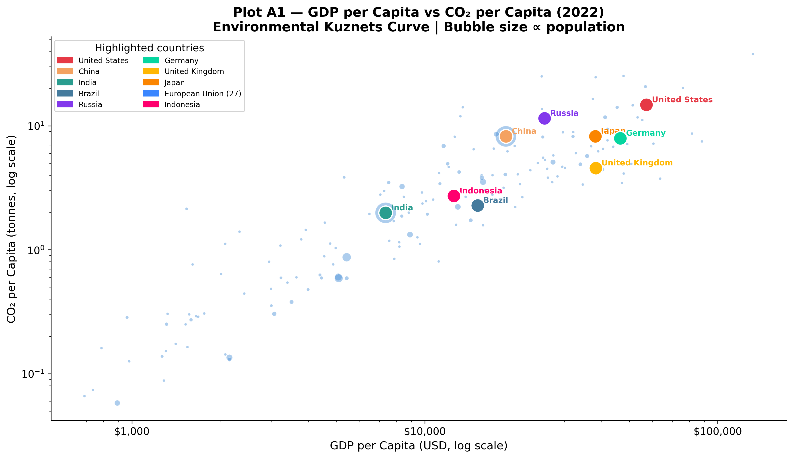
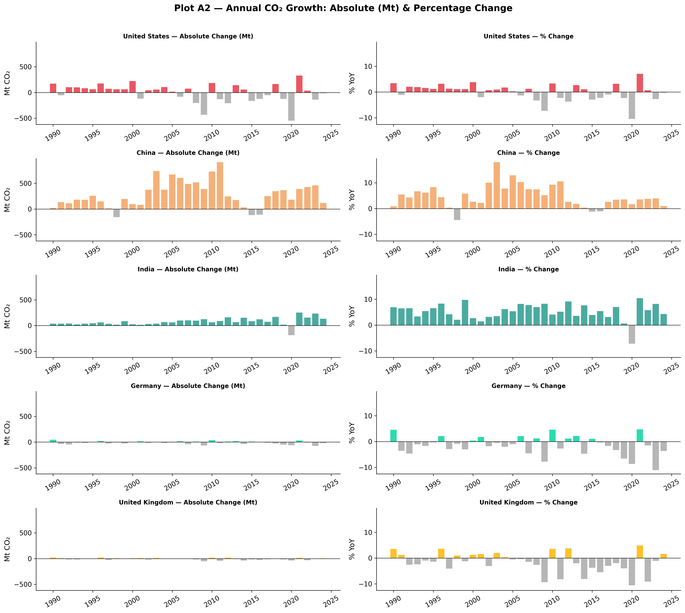
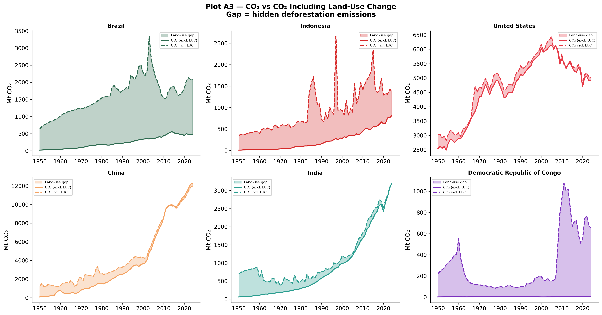
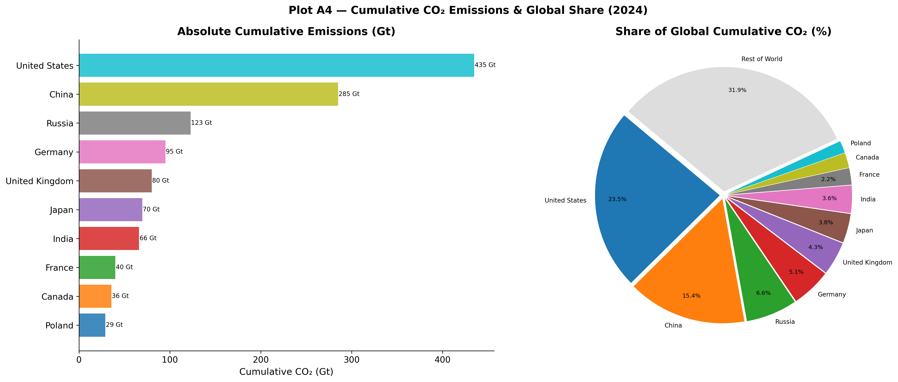

```{python}
#| echo: false
import warnings
warnings.filterwarnings("ignore")

import pandas as pd
import numpy as np
import matplotlib.pyplot as plt
import matplotlib.patches as mpatches
import matplotlib.ticker as mticker
import seaborn as sns
from pathlib import Path

%matplotlib inline
plt.rcParams.update({
    "font.family":       "DejaVu Sans",
    "font.size":         11,
    "axes.titlesize":    14,
    "axes.titleweight":  "bold",
    "axes.labelsize":    12,
    "axes.spines.top":   False,
    "axes.spines.right": False,
    "figure.dpi":        120,
    "savefig.dpi":       300,
    "savefig.bbox":      "tight",
    "savefig.facecolor": "white",
    "legend.framealpha": 0.85,
})

COUNTRY_COLORS = {
    "United States":       "#E63946",
    "China":               "#F4A261",
    "India":               "#2A9D8F",
    "Brazil":              "#457B9D",
    "Russia":              "#8338EC",
    "Germany":             "#06D6A0",
    "United Kingdom":      "#FFB703",
    "Japan":               "#FB8500",
    "European Union (27)": "#3A86FF",
    "Indonesia":           "#FF006E",
}

# Load data
CSV_PATH = "./owid-co2-data.csv"
df = pd.read_csv(CSV_PATH, low_memory=False)
if "gdp_per_capita" not in df.columns:
    df["gdp_per_capita"] = df["gdp"] / df["population"]

country_df = df[df["iso_code"].notna() & (df["iso_code"] != "")].copy()
world_df   = df[df["country"] == "World"].copy()

# Output directory
OUT = Path("./Plots/A")
OUT.mkdir(parents=True, exist_ok=True)
```

## The Environmental Kuznets Curve

Historically, economic development has been inextricably linked to carbon emissions. Plot A1 explores the hypothesis underlying the Environmental Kuznets Curve (EKC): as countries industrialize, their emissions per capita rise alongside GDP, but upon reaching a certain wealth threshold, economies can transition to cleaner trajectories.



```{python}
df_v = country_df.dropna(subset=["gdp_per_capita","co2_per_capita"])
df_v = df_v[(df_v["gdp_per_capita"] > 0) & (df_v["co2_per_capita"] > 0)]
yr   = df_v["year"].max()
d    = df_v[df_v["year"] == yr][["country","gdp_per_capita","co2_per_capita","population"]].copy()

fig, ax = plt.subplots(figsize=(12, 7))
sizes   = np.clip(d["population"] / 1e6 * 0.35, 8, 550)
ax.scatter(d["gdp_per_capita"], d["co2_per_capita"],
           s=sizes, alpha=0.45, color="#4A90D9", edgecolors="white", linewidths=0.4,
           label="All countries (bubble ∝ population)")

for country, colour in COUNTRY_COLORS.items():
    row = d[d["country"] == country]
    if row.empty: continue
    ax.scatter(row["gdp_per_capita"], row["co2_per_capita"],
               s=220, color=colour, edgecolors="white", linewidths=1.3, zorder=6)
    ax.annotate(country,
                (row["gdp_per_capita"].values[0], row["co2_per_capita"].values[0]),
                xytext=(6, 3), textcoords="offset points",
                fontsize=8.5, color=colour, fontweight="bold")

ax.set_xscale("log"); ax.set_yscale("log")
ax.set_xlabel("GDP per Capita (USD, log scale)")
ax.set_ylabel("CO₂ per Capita (tonnes, log scale)")
ax.set_title(f"Plot A1 — GDP per Capita vs CO₂ per Capita ({yr})\nEnvironmental Kuznets Curve | Bubble size ∝ population")
ax.xaxis.set_major_formatter(mticker.FuncFormatter(lambda x, _: f"${x:,.0f}"))
ax.legend(handles=[mpatches.Patch(color=c, label=n) for n, c in COUNTRY_COLORS.items()],
          title="Highlighted countries", loc="upper left", fontsize=8, ncol=2)

plt.tight_layout()
plt.savefig(OUT / "A1_gdp_vs_co2_per_capita.png")
plt.close()
```

A cross-sectional analysis of 2022 data confirms that wealth and emissions generally rise in tandem. Countries with a GDP per capita below $5,000 typically emit less than 1 tonne of CO₂ per person annually, whereas those exceeding $30,000 emit between 5 and 15 tonnes. However, crucial deviations exist:

- **Decoupling in Europe**: Germany and the United Kingdom sustain high living standards (GDP per capita ~$50,000) while emitting only 5–6 tonnes per capita—falling significantly below the expected trendline. This provides empirical evidence that aggressive policy choices (e.g., Germany's *Energiewende* and the UK's offshore wind deployment) can effectively decouple economic growth from carbon intensity.
- **The US Outlier**: The United States emits approximately 15 tonnes per capita despite a GDP per capita of ~$76,000. This is more than double Germany's per-capita footprint at a similar income level, highlighting structural differences such as car-dependent urban planning and historically cheap fossil fuels.
- **Population Multipliers**: China and India fall relatively close to the median trendline on a per-capita basis. However, their massive populations act as significant multipliers, establishing them as two of the world's largest absolute emitters. 

## Examining Growth Rates

Plot A2 transitions from a static snapshot to long-term trajectories, comparing both absolute (megatonnes) and proportional (%) changes across major economies.



```{python}
countries_g = ["United States","China","India","Germany","United Kingdom"]
palette_g   = [COUNTRY_COLORS[c] for c in countries_g]

fig, axes = plt.subplots(len(countries_g), 2, figsize=(16, 14), sharey="col")
fig.suptitle("Plot A2 — Annual CO₂ Growth: Absolute (Mt) & Percentage Change", fontsize=15, fontweight="bold", y=1.01)

for i, (country, colour) in enumerate(zip(countries_g, palette_g)):
    sub = country_df[(country_df["country"] == country) & (country_df["year"] >= 1990)].copy()
    sub = sub.dropna(subset=["co2_growth_abs","co2_growth_prct"])

    ax1 = axes[i, 0]
    colors_abs = [colour if v >= 0 else "#AAAAAA" for v in sub["co2_growth_abs"]]
    ax1.bar(sub["year"], sub["co2_growth_abs"], color=colors_abs, width=0.8, alpha=0.85)
    ax1.axhline(0, color="black", linewidth=0.7)
    ax1.set_title(f"{country} — Absolute Change (Mt)", fontsize=10)
    ax1.set_ylabel("Mt CO₂")

    # % change
    ax2 = axes[i, 1]
    colors_pct = [colour if v >= 0 else "#AAAAAA" for v in sub["co2_growth_prct"]]
    ax2.bar(sub["year"], sub["co2_growth_prct"], color=colors_pct, width=0.8, alpha=0.85)
    ax2.axhline(0, color="black", linewidth=0.7)
    ax2.set_title(f"{country} — % Change", fontsize=10)
    ax2.set_ylabel("% YoY")

for ax in axes.flat:
    ax.tick_params(axis="x", rotation=30)
    ax.spines["top"].set_visible(False)
    ax.spines["right"].set_visible(False)

plt.tight_layout()
plt.savefig(OUT / "A2_co2_growth_rates.png")
plt.close()
```

Evaluating both absolute and percentage changes reveals distinct structural phases across differing economies:

- **Structural Decline**: Germany and the UK show consistent annual percentage declines, showcasing a sustained, policy-driven decarbonization process. The US demonstrates a similar structural reduction over the last decade, albeit punctuated by cyclic economic shocks.
- **Decelerating Growth**: China exhibited explosive carbon growth through the 2000s, often adding over 500 Mt CO₂ annually. Post-2014, this growth has visibly decelerated as the economy rebalances toward services and renewables, although absolute baseline additions remain massive.
- **Unbroken Expansion**: India exhibits steady, unabated growth in emissions. As development continues on its current trajectory, India's contribution to global emissions is projected to expand significantly over the coming decades.

## The Hidden Impact of Land-Use Change

Traditional climate metrics often focus exclusively on fossil fuel combustion and industrial processes. Plot A3 incorporates Land-Use Change (LUC)—such as deforestation and agricultural expansion—revealing a hidden dimension of historical emissions.



```{python}
countries_luc = ["Brazil","Indonesia","United States","China","India","Democratic Republic of Congo"]
colours_luc   = ["#2D6A4F","#D62828","#E63946","#F4A261","#2A9D8F","#7B2FBE"]

fig, axes = plt.subplots(2, 3, figsize=(17, 9))
fig.suptitle("Plot A3 — CO₂ vs CO₂ Including Land-Use Change\nGap = hidden deforestation emissions", fontsize=14, fontweight="bold")

for ax, country, colour in zip(axes.flat, countries_luc, colours_luc):
    sub = country_df[(country_df["country"] == country) & (country_df["year"] >= 1950)].dropna(subset=["co2","co2_including_luc"])
    ax.fill_between(sub["year"], sub["co2"], sub["co2_including_luc"],
                    alpha=0.30, color=colour, label="Land-use gap")
    ax.plot(sub["year"], sub["co2"],              color=colour,    linewidth=2.0, label="CO₂ (excl. LUC)")
    ax.plot(sub["year"], sub["co2_including_luc"], color=colour,    linewidth=2.0, linestyle="--", label="CO₂ incl. LUC")
    ax.set_title(country, fontsize=11, fontweight="bold")
    ax.set_ylabel("Mt CO₂")
    ax.legend(fontsize=7)
    ax.spines["top"].set_visible(False)
    ax.spines["right"].set_visible(False)

plt.tight_layout()
plt.savefig(OUT / "A3_co2_vs_co2_including_luc.png")
plt.close()
```

For industrialized nations like the United States and China, fossil fuel combustion fundamentally dominates the emission profile; the inclusion of LUC data yields little material difference. However, for heavily forested tropical nations, LUC fundamentally alters our understanding of their climate impact:

- **Brazil**: Including LUC identifies a massive historical carbon spike peaking around 2005, driven by Amazon deforestation. At its peak, Brazil's total footprint was heavily understated in standard metrics. Strict enforcement policies post-2005 managed to collapse this gap substantially.
- **Indonesia**: Land-use emissions manifest not as a stable curve but as violent, episodic spikes, correlating tightly with El Niño-driven peatland fires and intentional forest clearance.
- **The Democratic Republic of Congo**: Overwhelmingly reliant on land-use emissions rather than fossil fuels. Excluding LUC renders standard carbon counting essentially meaningless for estimating the nation's true climate footprint.

## Historical Responsibility

Greenhouse gases persist in the atmosphere for centuries. Therefore, evaluating climate justice requires analyzing *cumulative* historical emissions rather than solely weighing present-day annual outputs.



```{python}
top_countries = ["United States","China","Russia","Germany","United Kingdom",
                 "Japan","India","France","Canada","Poland"]

fig, (ax1, ax2) = plt.subplots(1, 2, figsize=(17, 7))
fig.suptitle("Plot A4 — Cumulative CO₂ Emissions & Global Share (2024)", fontsize=14, fontweight="bold")

# Left: bar chart of absolute cumulative
vals = []
for c in top_countries:
    row = country_df[(country_df["country"]==c) & (country_df["year"]==2024)]["cumulative_co2"]
    vals.append(row.values[0] if not row.empty else 0)
colours_cum = plt.cm.get_cmap("tab10", len(top_countries))
bars = ax1.barh(top_countries[::-1], [v/1000 for v in vals[::-1]],
                color=[colours_cum(i) for i in range(len(top_countries))], alpha=0.85)
ax1.set_xlabel("Cumulative CO₂ (Gt)")
ax1.set_title("Absolute Cumulative Emissions (Gt)")
for bar, val in zip(bars, [v/1000 for v in vals[::-1]]):
    ax1.text(val + 0.5, bar.get_y() + bar.get_height()/2, f"{val:.0f} Gt",
             va="center", fontsize=8)

# Right: share of global cumulative — pie
share_vals = []
for c in top_countries:
    row = country_df[(country_df["country"]==c) & (country_df["year"]==2024)]["share_global_cumulative_co2"]
    share_vals.append(row.values[0] if not row.empty else 0)
rest = 100 - sum(share_vals)
labels_pie = top_countries + ["Rest of World"]
vals_pie   = share_vals + [rest]
explode    = [0.03]*len(labels_pie)
wedge_colours = [colours_cum(i) for i in range(len(top_countries))] + ["#DDDDDD"]
wedges, texts, autotexts = ax2.pie(
    vals_pie, labels=labels_pie, autopct=lambda p: f"{p:.1f}%" if p > 2 else "",
    startangle=140, colors=wedge_colours, explode=explode,
    pctdistance=0.82, labeldistance=1.07)
for t in texts: t.set_fontsize(8)
for t in autotexts: t.set_fontsize(7.5)
ax2.set_title("Share of Global Cumulative CO₂ (%)")

plt.tight_layout()
plt.savefig(OUT / "A4_cumulative_co2.png")
plt.close()
```

By 2024, cumulative accounting exposes profound structural inequalities:

- **The United States** is responsible for approximately 23.5% of the total cumulative industrial CO₂ in the atmosphere (435 Gt), despite holding only ~4% of the global population. 
- Early industrializers—such as the UK, Germany, and Russia—carry massive historical footprints disproportionate to their modern annual outputs, highlighting the lasting legacy of the 19th and 20th-century coal eras.
- **The Rest of the World (180+ nations)**, which comprises regions facing the most severe and immediate anthropogenic climate impacts (including sub-Saharan Africa and Southeast Asia), accounts for under 32% of total cumulative emissions combined. This relationship is formally tested in [Chapter F](hypotheses.qmd) under H5 — Per-Capita Equity, confirmed at p=1.1e-14.

### Limitations & Methodological Notes
It is important to acknowledge that Plot A1 and A2 rely purely on *production-based* emissions (where the CO₂ is physically emitted). Plot A4 estimates historical responsibility starting from the industrial revolution, meaning choices in baseline years mildly affect relative share percentages. Finally, land-use data (Plot A3) inherently carries higher uncertainty bounds than fossil fuel sales, due to reliance on satellite estimations and diverse land-cover models.
