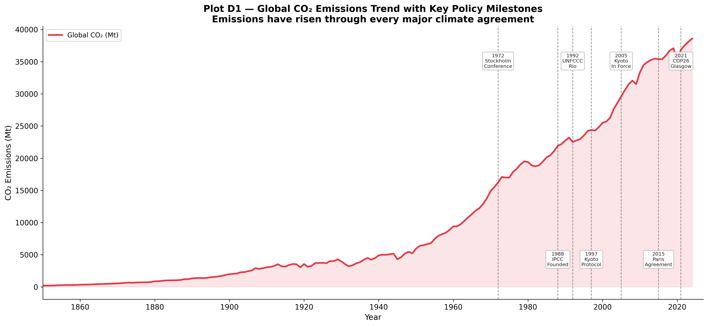
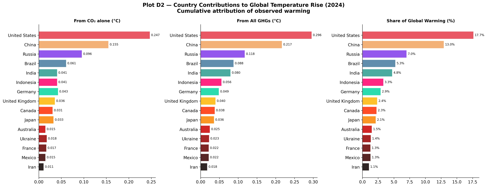
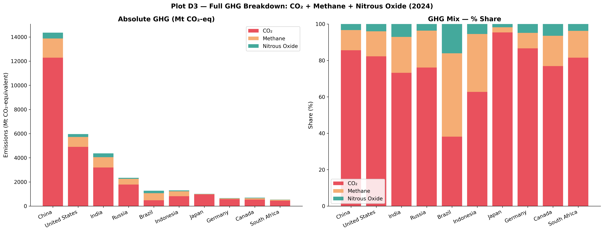
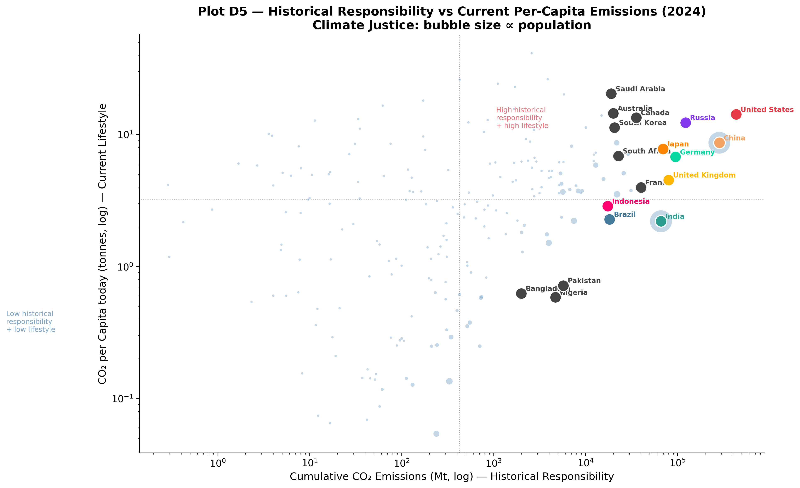
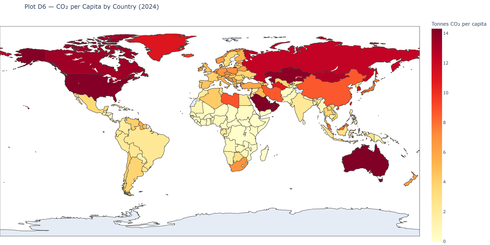

```{python}
#| echo: false
import warnings
warnings.filterwarnings("ignore")

import pandas as pd
import numpy as np
import matplotlib.pyplot as plt
import matplotlib.patches as mpatches
import matplotlib.ticker as mticker
import seaborn as sns
from pathlib import Path

%matplotlib inline
plt.rcParams.update({
    "font.family":       "DejaVu Sans",
    "font.size":         11,
    "axes.titlesize":    14,
    "axes.titleweight":  "bold",
    "axes.labelsize":    12,
    "axes.spines.top":   False,
    "axes.spines.right": False,
    "figure.dpi":        120,
    "savefig.dpi":       300,
    "savefig.bbox":      "tight",
    "savefig.facecolor": "white",
    "legend.framealpha": 0.85,
})

COUNTRY_COLORS = {
    "United States":       "#E63946",
    "China":               "#F4A261",
    "India":               "#2A9D8F",
    "Brazil":              "#457B9D",
    "Russia":              "#8338EC",
    "Germany":             "#06D6A0",
    "United Kingdom":      "#FFB703",
    "Japan":               "#FB8500",
    "European Union (27)": "#3A86FF",
    "Indonesia":           "#FF006E",
}

# Load data
CSV_PATH = "./owid-co2-data.csv"
df = pd.read_csv(CSV_PATH, low_memory=False)
if "gdp_per_capita" not in df.columns:
    df["gdp_per_capita"] = df["gdp"] / df["population"]

country_df = df[df["iso_code"].notna() & (df["iso_code"] != "")].copy()
world_df   = df[df["country"] == "World"].copy()

# Output directory
OUT = Path("./Plots/D")
OUT.mkdir(parents=True, exist_ok=True)
```

## The Trajectory of Global Emissions and Policy

How effective has international climate governance been? Plot D1 overlays global CO₂ emissions with major international climate milestones, from the 1972 Stockholm Conference through the 2015 Paris Agreement.



```{python}
world9 = df[df["country"] == "World"][["year","co2"]].dropna()
if world9.empty:
    world9 = country_df.groupby("year", as_index=False)["co2"].sum()
world9 = world9[world9["year"] >= 1850].copy()

milestones = {
    1972: ("Stockholm\nConference", "top"),
    1988: ("IPCC\nFounded",         "bottom"),
    1992: ("UNFCCC\nRio",           "top"),
    1997: ("Kyoto\nProtocol",       "bottom"),
    2005: ("Kyoto\nIn Force",       "top"),
    2015: ("Paris\nAgreement",      "bottom"),
    2021: ("COP26\nGlasgow",        "top"),
}

fig, ax = plt.subplots(figsize=(15, 7))
ax.fill_between(world9["year"], world9["co2"], alpha=0.13, color="#E63946")
ax.plot(world9["year"], world9["co2"], color="#E63946", linewidth=2.5, label="Global CO₂ (Mt)")

ymax = world9["co2"].max()
for yr_m, (label, pos) in milestones.items():
    ax.axvline(yr_m, color="#555555", linewidth=1.0, linestyle="--", alpha=0.65)
    y_text = ymax * 0.94 if pos == "top" else ymax * 0.08
    ax.text(yr_m, y_text, f"{yr_m}\n{label}",
            ha="center", va="top" if pos == "top" else "bottom",
            fontsize=7.5, color="#222222",
            bbox=dict(boxstyle="round,pad=0.28", fc="white", ec="#BBBBBB", alpha=0.9))

ax.set_xlabel("Year", fontsize=12)
ax.set_ylabel("CO₂ Emissions (Mt)", fontsize=12)
ax.set_title("Plot D1 — Global CO₂ Emissions Trend with Key Policy Milestones\nEmissions have risen through every major climate agreement", fontsize=14, fontweight="bold")
ax.set_xlim(1850, world9["year"].max() + 3)
ax.legend(loc="upper left", fontsize=10)

plt.tight_layout()
plt.savefig(OUT / "D1_global_co2_trend_milestones.png")
plt.close()
```

A striking paradox emerges: **global emissions have continued rising almost continuously despite decades of international climate agreements**. While policies have undoubtedly prevented worse trajectories, economic growth—particularly the rapid, post-2000 industrialization in Asia—has historically outpaced mitigation efforts. The only visible downward spikes represent major global macroeconomic shocks (e.g., world wars, financial crises, and COVID-19), but these are inevitably followed by rapid rebounds.

## Attributing Temperature Rise

A direct way to assess historical responsibility is to model how a nation's cumulative emissions translate into observed global warming. Plot D2 visualizes the estimated temperature contribution (in °C) generated by individual countries.



```{python}
df_temp = country_df[country_df["year"] == 2024][
    ["country","temperature_change_from_co2","temperature_change_from_ghg","share_of_temperature_change_from_ghg"]
].dropna().nlargest(15, "temperature_change_from_ghg").reset_index(drop=True)

fig, axes = plt.subplots(1, 3, figsize=(18, 7))
fig.suptitle("Plot D2 — Country Contributions to Global Temperature Rise (2024)\nCumulative attribution of observed warming", fontsize=14, fontweight="bold")

cmap_t = plt.cm.get_cmap("hot_r", len(df_temp))

for ax, col, title in zip(axes,
    ["temperature_change_from_co2","temperature_change_from_ghg","share_of_temperature_change_from_ghg"],
    ["From CO₂ alone (°C)","From All GHGs (°C)","Share of Global Warming (%)"]):
    colours_t = [COUNTRY_COLORS.get(c, cmap_t(i/len(df_temp))) for i, c in enumerate(df_temp["country"])]
    bars = ax.barh(df_temp["country"][::-1], df_temp[col][::-1],
                   color=colours_t[::-1], alpha=0.85, edgecolor="white")
    for bar, val in zip(bars, df_temp[col][::-1]):
        ax.text(val + max(df_temp[col])*0.01, bar.get_y() + bar.get_height()/2,
                f"{val:.3f}" if "share" not in col else f"{val:.1f}%",
                va="center", fontsize=8)
    ax.set_title(title, fontsize=11, fontweight="bold")
    ax.spines["top"].set_visible(False); ax.spines["right"].set_visible(False)

plt.tight_layout()
plt.savefig(OUT / "D2_temperature_change_attribution.png")
plt.close()
```

- **The United States** is the single largest driver of anthropogenic warming, responsible for approximately 17–18% of the global temperature rise, owing to over a century of sustained, high-volume carbon output.
- **China** ranks second. While its massive industrial expansion is a relatively recent phenomenon, the staggering absolute volume of emissions in the 21st century has rapidly increased its warming contribution.
- **Europe's Legacy**: The UK and Germany rank highly despite diminishing present-day emissions. Their contributions represent the atmospheric "debt" of being the earliest industrializers.

## The Scope of Greenhouse Gases

While CO₂ captures the majority of public attention, greenhouse gas (GHG) accounting is incomplete without methane (CH₄) and nitrous oxide (N₂O).



```{python}
countries_d3 = ["China","United States","India","Russia","Brazil","Indonesia","Japan","Germany","Canada","South Africa"]
latest_d3 = 2024

rows_d3 = []
for c in countries_d3:
    row = country_df[(country_df["country"]==c)&(country_df["year"]==latest_d3)][["co2","methane","nitrous_oxide","total_ghg"]].dropna()
    if not row.empty:
        rows_d3.append({"country": c,
                        "CO₂": row["co2"].values[0],
                        "Methane": row["methane"].values[0],
                        "Nitrous Oxide": row["nitrous_oxide"].values[0]})

df_d3 = pd.DataFrame(rows_d3)
ghg_cols = ["CO₂","Methane","Nitrous Oxide"]
ghg_colours = ["#E63946","#F4A261","#2A9D8F"]

fig, (ax_abs, ax_pct) = plt.subplots(1, 2, figsize=(18, 7))
fig.suptitle(f"Plot D3 — Full GHG Breakdown: CO₂ + Methane + Nitrous Oxide ({latest_d3})", fontsize=14, fontweight="bold")

bottom_abs = np.zeros(len(df_d3))
for col, colour in zip(ghg_cols, ghg_colours):
    vals = df_d3[col].values
    ax_abs.bar(df_d3["country"], vals, bottom=bottom_abs, label=col, color=colour, alpha=0.88)
    bottom_abs += vals
ax_abs.set_xticklabels(df_d3["country"], rotation=25, ha="right")
ax_abs.set_ylabel("Emissions (Mt CO₂-equivalent)")
ax_abs.set_title("Absolute GHG (Mt CO₂-eq)")
ax_abs.legend(); ax_abs.spines["top"].set_visible(False); ax_abs.spines["right"].set_visible(False)

df_d3_pct = df_d3[ghg_cols].div(df_d3[ghg_cols].sum(axis=1), axis=0) * 100
bottom_pct = np.zeros(len(df_d3))
for col, colour in zip(ghg_cols, ghg_colours):
    ax_pct.bar(df_d3["country"], df_d3_pct[col].values, bottom=bottom_pct, label=col, color=colour, alpha=0.88)
    bottom_pct += df_d3_pct[col].values
ax_pct.set_xticklabels(df_d3["country"], rotation=25, ha="right")
ax_pct.set_ylabel("Share (%)")
ax_pct.set_title("GHG Mix — % Share")
ax_pct.set_ylim(0, 100)
ax_pct.legend(); ax_pct.spines["top"].set_visible(False); ax_pct.spines["right"].set_visible(False)

plt.tight_layout()
plt.savefig(OUT / "D3_full_ghg_breakdown.png")
plt.close()
```

When viewed in CO₂-equivalent terms, a more nuanced structure of national footprints emerges. While CO₂ dominates fossil-fuel-centric economies, nations with vast agricultural footprints or active land-clearing (such as Brazil and Indonesia) exhibit massive methane footprints. Comprehensive climate mitigation is impossible without addressing these shorter-lived but highly potent gases.

## The Geography of Historical vs. Current Responsibility

The central tension in climate justice lies in the difference between *who caused the problem historically* and *who is emitting most today*.

Plot D4 highlights the shifting temporal dynamics of global emissions shares. For most of the 20th century, the US and Europe dominated global output. However, by the early 2000s, China rapidly overtook the US in annual shares. The geographic center of global emissions has irrevocably shifted from Western industrial economies to emerging Asian economies.

We visualize this tension between past and present in Plot D5, setting historical cumulative emissions against current per-capita emissions.



```{python}
df_d5 = country_df.dropna(subset=["cumulative_co2","co2_per_capita"])
df_d5 = df_d5[(df_d5["cumulative_co2"] > 0) & (df_d5["co2_per_capita"] > 0)]
yr_d5 = df_d5["year"].max()
d5    = df_d5[df_d5["year"] == yr_d5][["country","cumulative_co2","co2_per_capita","population"]].copy()

label_d5 = ["United States","China","Russia","Germany","United Kingdom","India","Japan",
            "Canada","Australia","Brazil","France","South Africa","South Korea","Saudi Arabia",
            "Indonesia","Nigeria","Bangladesh","Pakistan"]

fig, ax = plt.subplots(figsize=(13, 8))
sizes_d5 = np.clip(d5["population"] / 1e6 * 0.45, 8, 700)
ax.scatter(d5["cumulative_co2"], d5["co2_per_capita"],
           s=sizes_d5, alpha=0.40, color="#6B9BC3", edgecolors="white", linewidths=0.3,
           label="All countries")

for country in label_d5:
    row = d5[d5["country"] == country]
    if row.empty: continue
    col = COUNTRY_COLORS.get(country, "#444444")
    ax.scatter(row["cumulative_co2"], row["co2_per_capita"],
               s=180, color=col, edgecolors="white", linewidths=1.2, zorder=6)
    ax.annotate(country, (row["cumulative_co2"].values[0], row["co2_per_capita"].values[0]),
                xytext=(5, 3), textcoords="offset points", fontsize=8, color=col, fontweight="bold")

# Quadrant lines
med_x = d5["cumulative_co2"].median()
med_y = d5["co2_per_capita"].median()
ax.axvline(med_x, color="grey", linewidth=0.8, linestyle=":", alpha=0.7)
ax.axhline(med_y, color="grey", linewidth=0.8, linestyle=":", alpha=0.7)
ax.text(med_x * 2.5, med_y * 3.5, "High historical\nresponsibility\n+ high lifestyle", fontsize=8, color="#E63946", alpha=0.7)
ax.text(0.005, med_y * 0.1, "Low historical\nresponsibility\n+ low lifestyle", fontsize=8, color="steelblue", alpha=0.7)

ax.set_xscale("log"); ax.set_yscale("log")
ax.set_xlabel("Cumulative CO₂ Emissions (Mt, log) — Historical Responsibility")
ax.set_ylabel("CO₂ per Capita today (tonnes, log) — Current Lifestyle")
ax.set_title(f"Plot D5 — Historical Responsibility vs Current Per-Capita Emissions ({yr_d5})\nClimate Justice: bubble size ∝ population")

plt.tight_layout()
plt.savefig(OUT / "D5_historical_vs_current_climate_justice.png")
plt.close()
```

- **High-Income Emitters (US, Australia, Saudi Arabia)**: Sit in the upper-right quadrant, holding both massive historical responsibility and maintaining high present-day per-capita lifestyle emissions.
- **China**: Holds high historical responsibility (due to massive recent output) but maintains moderate per-capita emissions.
- **India**: Despite its massive population and rising annual totals, India remains firmly anchored low on the vertical axis, symbolizing extremely low per-capita footprints.

Plot D6 reinforces this inequality via a choropleth map of current per-capita emissions:



```{python}
df_d6 = country_df.dropna(subset=["co2_per_capita"])
df_d6 = df_d6[df_d6["co2_per_capita"] > 0]
yr_d6 = df_d6["year"].max()
d6    = df_d6[df_d6["year"] == yr_d6][["country","iso_code","co2_per_capita"]].copy()

HAS_PLOTLY = False
try:
    import plotly.express as px
    HAS_PLOTLY = True
except ImportError:
    pass

if HAS_PLOTLY:
    fig_d6 = px.choropleth(
        d6, locations="iso_code", color="co2_per_capita",
        hover_name="country",
        color_continuous_scale="YlOrRd",
        range_color=(0, d6["co2_per_capita"].quantile(0.95)),
        labels={"co2_per_capita": "CO₂ per Capita (t)"},
        title=f"Plot D6 — CO₂ per Capita by Country ({yr_d6})",
    )
    fig_d6.update_layout(margin=dict(l=0, r=0, t=50, b=0), height=520,
                         coloraxis_colorbar=dict(title="Tonnes CO₂\nper capita"))
    fig_d6.write_image(str(OUT / "D6_choropleth_co2_per_capita.png"), width=1400, height=700, scale=2)
    # fig_d6.show()
else:
    top30 = d6.nlargest(30, "co2_per_capita").reset_index(drop=True)
    cmap6 = plt.cm.get_cmap("YlOrRd", 30)
    fig, ax = plt.subplots(figsize=(13, 9))
    ax.barh(top30["country"][::-1], top30["co2_per_capita"][::-1],
            color=[cmap6(i/30) for i in range(len(top30))][::-1],
            edgecolor="white", linewidth=0.4)
    sm = plt.cm.ScalarMappable(cmap="YlOrRd", norm=plt.Normalize(0, top30["co2_per_capita"].max()))
    sm.set_array([])
    cbar = fig.colorbar(sm, ax=ax, fraction=0.02, pad=0.02)
    cbar.set_label("CO₂ per Capita (tonnes)")
    ax.set_xlabel("CO₂ per Capita (tonnes)")
    ax.set_title(f"Plot D6 — Top 30 Countries by CO₂ per Capita ({yr_d6})\n(Install plotly for interactive world map)")
    ax.spines["left"].set_visible(False); ax.tick_params(left=False)
    plt.tight_layout()
    plt.savefig(OUT / "D6_co2_per_capita_ranked.png")
    plt.close()
```

The map paints a stark reality: individual citizens in the wealthiest nations and resource-rich Gulf states generate dramatically more carbon annually than the average citizen in Sub-Saharan Africa or South Asia.

### Synthesis

Climate negotiations frequently stall on the dual dimensions of responsibility. Developed nations argue that mitigation must include modern behemoths like China and India, as their current trajectories dictate the future climate. Developing nations accurately counter that the West filled the atmospheric carbon budget first to build their wealthy economies, making strict, uniform present-day restrictions fundamentally inequitable. Historical responsibility is formally tested in [H4](hypotheses.qmd#h4-historical-responsibility), with Spearman ρ=0.853, p=6.2e-62.
